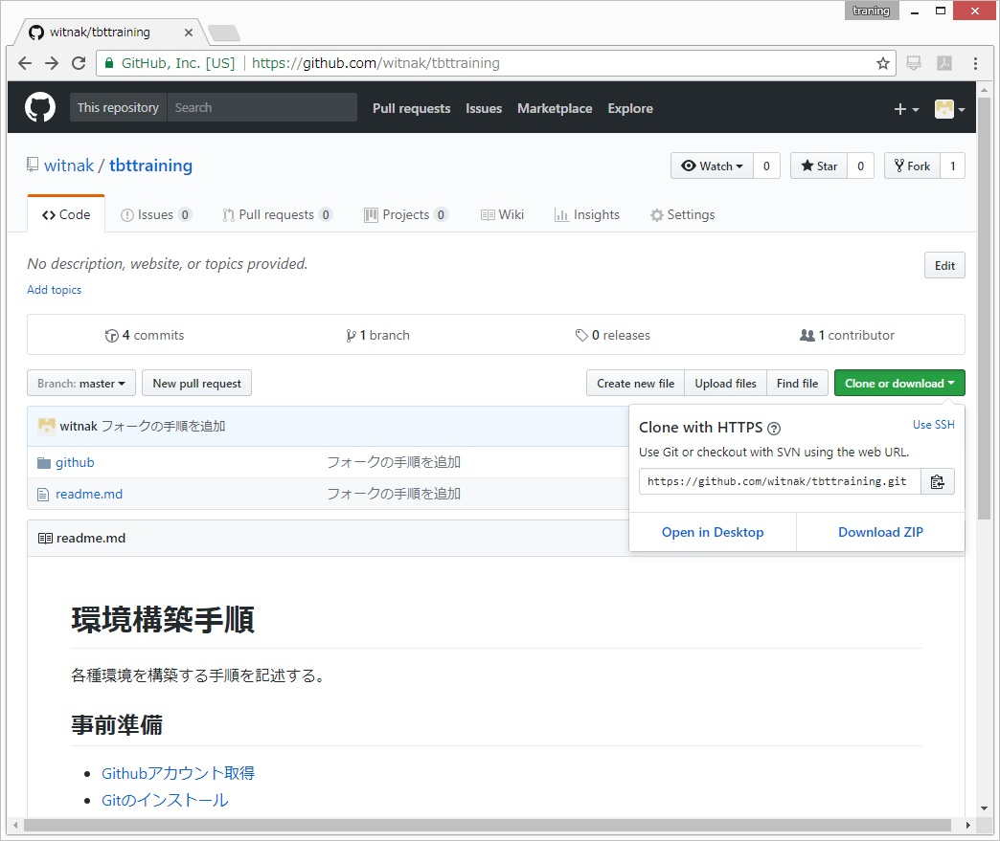

# ローカルPCへクローンする

前提として、リポジトリのフォークとGitのインストールは完了していること。  

0. フォルダを作成してそこに移動。  
どこに作成するかは、任意。  
以下は、　`c:\ws\practice\`　にクローンする想定。  
```
 cd c:
 mkdir ws
 cd ws
 mkdir practice
 cd practice
```

0. クローン用URLを取得する。  
  

0. クローンする。
```
git clone https://github.com/witnak/tbttraining.git
```

0. 以下は実行ログ  
```
  C:\ws\practice>git clone https://github.com/witnak/tbttraining.git
  Cloning into 'tbttraining'...
  remote: Counting objects: 28, done.
  remote: Compressing objects: 100% (23/23), done.
  remote: Total 28 (delta 5), reused 28 (delta 5), pack-reused 0
  Unpacking objects: 100% (28/28), done.

  C:\ws\practice>
  C:\ws\practice>
  C:\ws\practice>dir
   ドライブ C のボリューム ラベルは Windows です
   ボリューム シリアル番号は CE4E-8211 です

   C:\ws\practice のディレクトリ

  2017/10/18  13:24    <DIR>          .
  2017/10/18  13:24    <DIR>          ..
  2017/10/18  13:25    <DIR>          tbttraining
                 0 個のファイル                   0 バイト
                 3 個のディレクトリ  282,090,782,720 バイトの空き領域

  C:\ws\practice>
```

0. 以降は、クローンしてきたフォルダに移って、作業をする。  
gitコマンドは検索して調べるか、以下を参考にする。  
 [Gitの基本的なコマンドメモ(abe-naoki)](https://github.com/abe-naoki/ruby_practice/blob/master/doc/git_memo.md)
